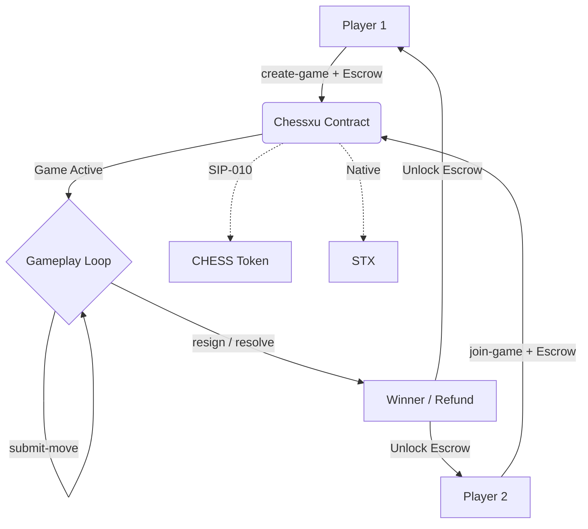

# ♟️ Chessxu - Multi-chain Crypto Chess

> **Complete React + Clarity integration documentation**
> Play chess and wager STX securely on the Stacks blockchain ⚡

[](https://stacks.co) [](https://clarity-lang.org) [](https://react.dev)

Welcome to **Chessxu**, a fully decentralized chess application built on the Stacks and Celo blockchains. Chessxu enables players to engage in PvP chess matches, completely tracked and resolved using smart contract state-machines, with crypto token wagers on the line.

---

## 🏗️ Project Structure

The repository is organized into a monorepo containing both the frontend web application and the Clarity smart contracts.

```text
chessxu/
├── frontend/          # React + Vite web application
├── stacks-contracts/  # Clarinet project with Stacks smart contracts
└── celo-contracts/    # Hardhat project with Celo smart contracts (EVM)
```

---

## 🚀 Quick Start

### 1. Running the Frontend

The frontend is a modern React application powered by Vite, providing the chess logic, UI, and Stacks wallet integration.

```bash
git clone https://github.com/morelucks/chessxu.git
cd chessxu/frontend

# Install dependencies
npm install

# Start the development server
npm run dev
```

Your client will be running locally at `http://localhost:5173` with optimistic updates and seamless blockchain connectivity.

### 2. Developing the Smart Contract

The core game logic and STX wagering system are managed by a Clarity smart contract (`chessxu.clar`). You need [Clarinet](https://github.com/hirosystems/clarinet) installed to interact with it.

```bash
cd chessxu/stacks-contracts

# Check the syntax of the Clarity contracts
clarinet check

# Run the Clarinet console to interact locally
clarinet console
```

---

## 📚 Technical Architecture

### **The Frontend (`frontend/`)**
- **Framework**: React + Vite + TypeScript
- **Styling**: TailwindCSS
- **State Management**: React `useReducer` for complex chess logic, combined with Context API.
- **Blockchain Integration**: (Planned) `@stacks/connect` for wallet authentication and transaction signing.

### **The Smart Contract (`stacks-contracts/`)**
- **Language**: Clarity
- **Core Features**:
  1. **Game Creation**: Players escrow STX to initialize a match (`create-game`).
  2. **Matchmaking**: Opponents match the wager to join (`join-game`).
  3. **State Machine**: Sequential validation of turns using FEN/ASCII board states (`submit-move`).
  4. **Resolution**: Securely handles forfeits (`resign`) or mutually/Oracle-agreed game resolutions (`resolve-game`).

### **Architecture Overview**



---

## 📝 Deployed Contracts (Mainnet)

### Stacks Mainnet
All Stacks contracts are deployed under the deployer address `SP34MN3DMM07BNAWYJSHTS4B08T8JRVK8AT810X1B`.

| Contract | Address | Explorer |
|---|---|---|
| **SIP-010 Trait** | `SP34MN3DMM07BNAWYJSHTS4B08T8JRVK8AT810X1B.sip-010-trait-ft-standard` | [View](https://explorer.hiro.so/txid/cbf387e01ae4a2965a50c3c44c04497e21f1c68623fa63b125b217f70352a97b?chain=mainnet) |
| **Chessxu Token (CHESS)** | `SP34MN3DMM07BNAWYJSHTS4B08T8JRVK8AT810X1B.chessxu-token` | [View](https://explorer.hiro.so/txid/36f62fb1a2a2010e00b70f6bcdbb9759d205e0b00229015a5127101716fab913?chain=mainnet) |
| **Chessxu Game** | `SP34MN3DMM07BNAWYJSHTS4B08T8JRVK8AT810X1B.chessxu` | [View](https://explorer.hiro.so/txid/0a9a3a2ee47d249797cbb79560436a6ea8b114b0be293ad11d83df519c11211f?chain=mainnet) |

### Celo Mainnet
The Celo contract is deployed on the Celo Mainnet.

| Contract | Address | Explorer |
|---|---|---|
| **Chessxu Game** | `0xC43b25bB19a6Ccca549bb8E5C21fF0C44161EA14` | [View](https://celoscan.io/address/0xC43b25bB19a6Ccca549bb8E5C21fF0C44161EA14) |

---

## 🎯 What You'll Learn

By exploring this repository, you'll see how to:
- Structure a monorepo for Stacks DApp development.
- Build complex game state handlers in React.
- Write robust, trustless state-machines in Clarity to track off-chain game progression securely.

---

## 🛠️ Tech Stack

```
Frontend:  React + Vite + TypeScript + TailwindCSS
State:     Context API + useReducer
Wallet:    Stacks Wallet (Leather/Xverse)
Contract:  Clarity + Clarinet
```

---

## 🌟 Key Features

**⚡ Instant Feedback**
- Playable purely in the browser with local move validation.
- Background blockchain confirmation without interrupting gameplay.

**🔧 Developer Experience**
- Complete TypeScript integration for strict type-safety.
- Separated boundaries between the `stacks-contracts` (and `celo-contracts`), and `frontend`.
- Zero-error ESLint configuration and production-ready `npm run build` process.

---

**Ready to build the future of onchain gaming?** Jump into the `frontend/`, `stacks-contracts/` or `celo-contracts/` directories to begin! 🚀
